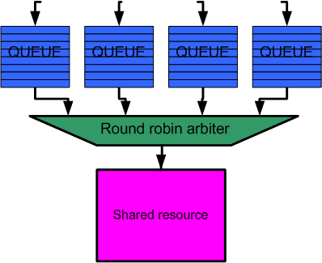
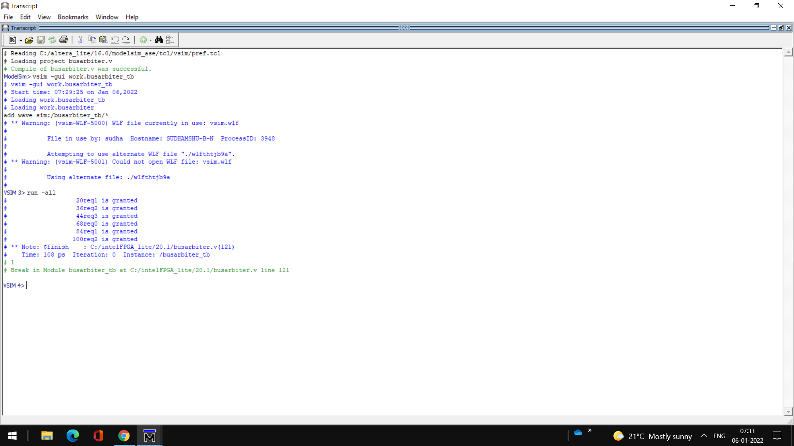
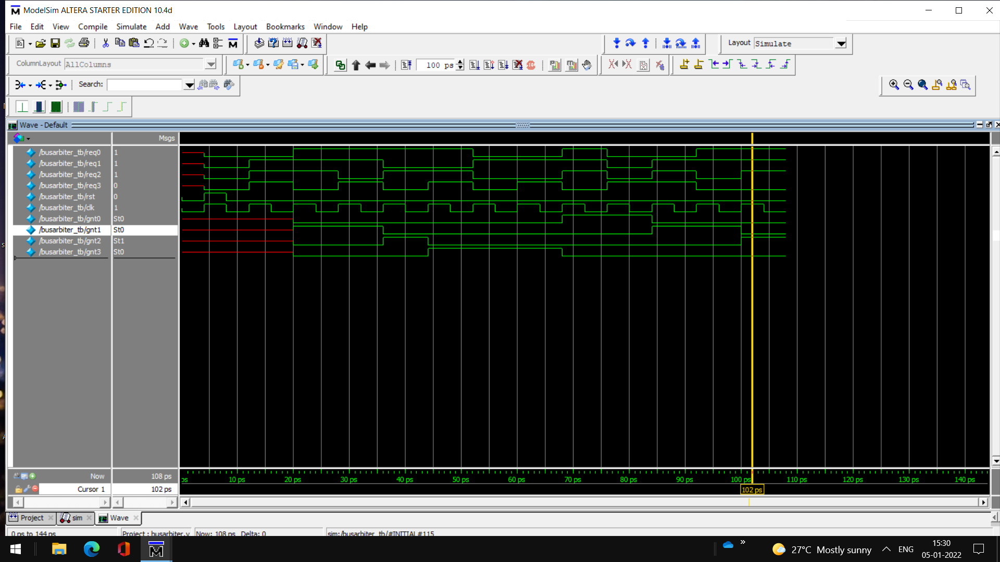

## Bus Arbiter
Arbitration is a scheduling scheme which gives to each requestor its share of using a common resource for a limited time or data elements. 
Example 
Arbiter 
 
Block Diagram 
 
Output 
 
Waveform 
 
