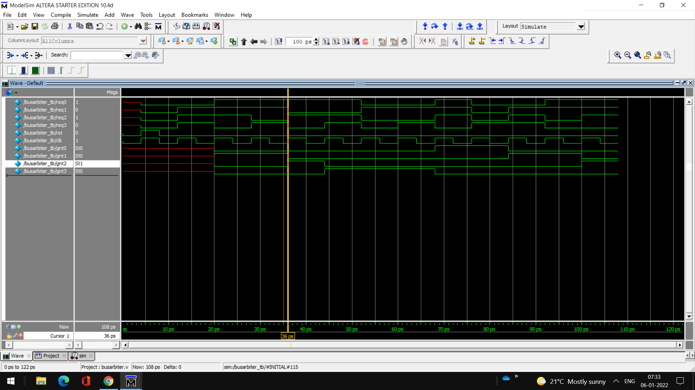

## Bus Arbiter
Arbitration is a scheduling scheme which gives to each requestor its share of using a common resource for a limited time or data elements. 
<h3>Arbiter</h3>

 
<h3>Block Diagram</h3>

 

[Code](busarbiter.v) 
[Testbench](busarbiter_tb.v) 
<h3>Output</h3>

 
<h3>Waveform</h3>

 
